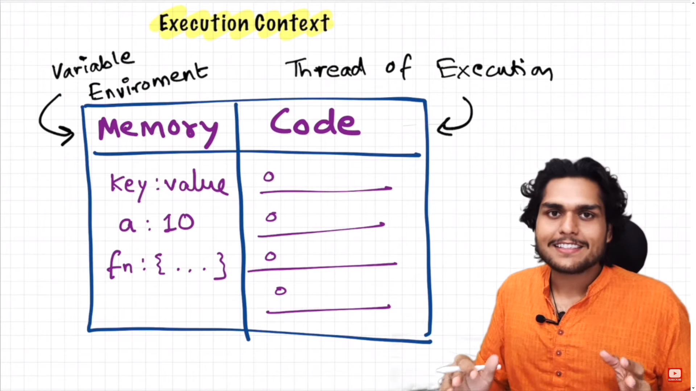

# Lecture Notes: How JavaScript Works

## Core Fundamental:
- **Execution Context**: 
  - Everything in JavaScript happens inside the execution context.
  - It can be visualized as a big box or container where JavaScript code is executed.

## Components of Execution Context:
1. **Memory Component (Variable Environment)**:
   - Stores variables and functions as key-value pairs.
   - Example: `a = 10`.
   
2. **Code Component (Thread of Execution)**:
   - Executes code line by line.
   - Synchronous execution in a specific order.

## JavaScript Characteristics:
- JavaScript is a **synchronous, single-threaded language**.
  - Executes one command at a time, in a specific order.
  - Thread of execution processes code sequentially.

## Recap of Execution Context:
- **Memory Component (Variable Environment)**:
  - Stores variables and functions.
- **Code Component (Thread of Execution)**:
  - Executes code line by line.

