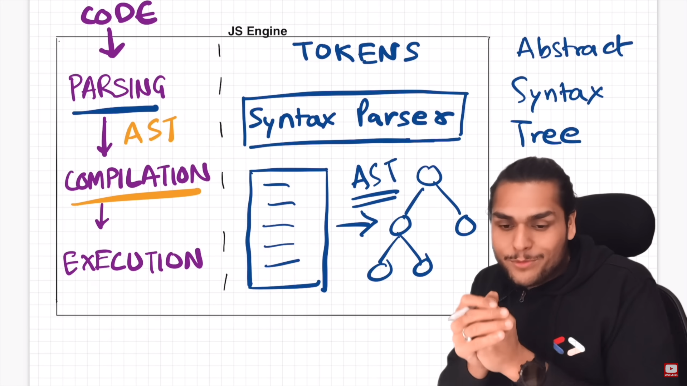
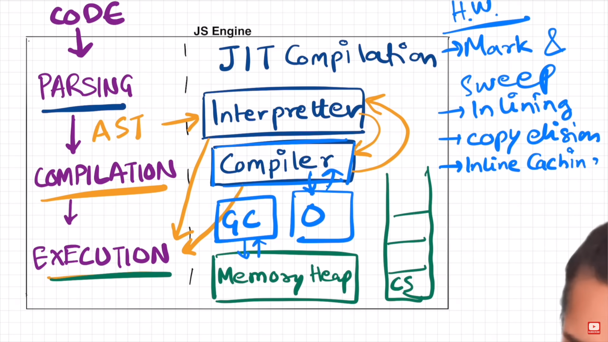
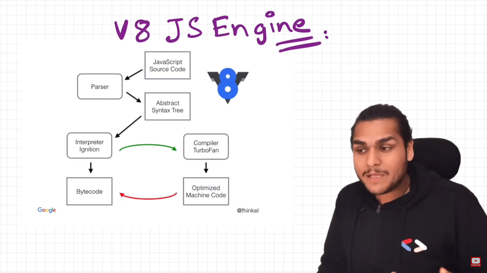

JavaScript Engine Overview
==========================

Introduction
------------

JavaScript is incredibly versatile and can run in various environments like browsers, servers, smartwatches, and even light bulbs. This is made possible by JavaScript runtime environments, which provide all the necessary components for executing JavaScript code.

Components of JavaScript Runtime Environment
--------------------------------------------

*   JavaScript Engine: The core component responsible for executing JavaScript code.
*   APIs: Sets of interfaces allowing JavaScript to interact with its environment.
*   Event Loop: Manages asynchronous operations and callbacks.
*   Callback Queue: Stores callback functions to be executed by the event loop.
*   Memory Heap: Allocates memory for variables and functions.
*   Call Stack: Keeps track of function calls and their execution contexts.
*   Garbage Collector: Cleans up unused memory space to prevent memory leaks.

JavaScript Engines
------------------

Various browsers have their own JavaScript engines, such as Chakra (Microsoft Edge), SpiderMonkey (Firefox), and V8 (Google Chrome). These engines adhere to ECMAScript standards and are responsible for parsing, compiling, and executing JavaScript code efficiently.

Execution Process
-----------------

JavaScript code undergoes parsing, compilation, and execution phases. Modern JavaScript engines employ just-in-time compilation, combining interpreter and compiler techniques for optimal performance.

V8 JavaScript Engine Architecture
---------------------------------

The V8 engine, used by Chrome and Node.js, consists of the Ignition interpreter and TurboFan optimizing compiler. It converts JavaScript code into bytecode, optimizes it, and executes it for enhanced speed and efficiency.

Conclusion
----------

Understanding the internals of JavaScript engines and runtime environments is essential for writing efficient JavaScript code. Each engine may implement optimizations differently, but they all strive to provide fast and reliable execution environments for JavaScript.