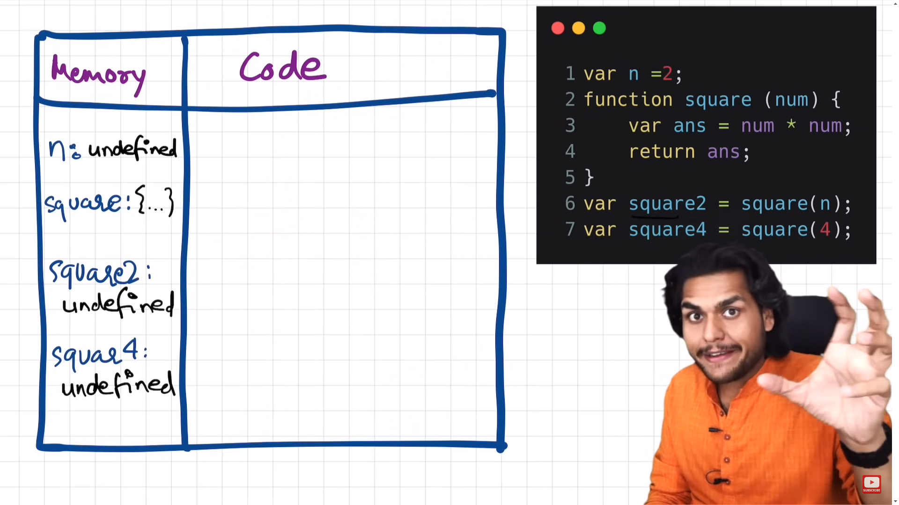
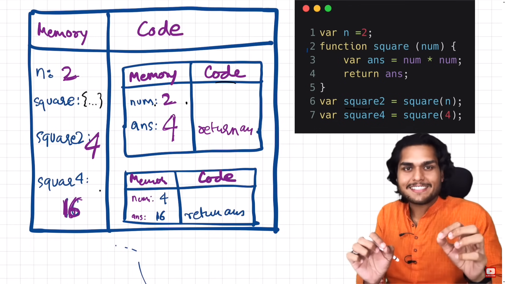

# Lecture Notes: JavaScript Program Execution

## Introduction:
- In JavaScript programs, many processes occur behind the scenes within the JavaScript engine.
- Understanding these processes is essential for mastering JavaScript.

## Execution Context:
- Recap: Everything in JavaScript operates within an execution context.
- When a JavaScript program is run, an execution context is created.

## Phases of Execution Context Creation:
1. **Memory Creation Phase**:
   - Memory is allocated for variables and functions.
   - Variables are assigned the value `undefined`, and functions have their code stored.
   - Example code:
     ```javascript
     var n = 2;
     function square(num) {
         var ans = num * num;
         return ans;
     }
     var square2 = square(n);
     var square4 = square(4);
     ```

   

2. **Code Execution Phase**:
   - JavaScript executes the code line by line.
   - Variables are assigned actual values during execution.
   - Functions are invoked and executed, leading to the creation of new execution contexts.



## Function Invocation:
- Invoking a function creates a new execution context.
- The function's code is executed within this new context.
- After execution, the context is removed from the stack.

## Call Stack:
- The call stack manages the order of execution of execution contexts.
- When a new context is created, it is pushed onto the stack.
- After execution, the context is popped off the stack.

## Conclusion:
- Understanding how execution contexts are created and managed is crucial for understanding JavaScript program execution.
- The call stack plays a vital role in managing the order of execution.
